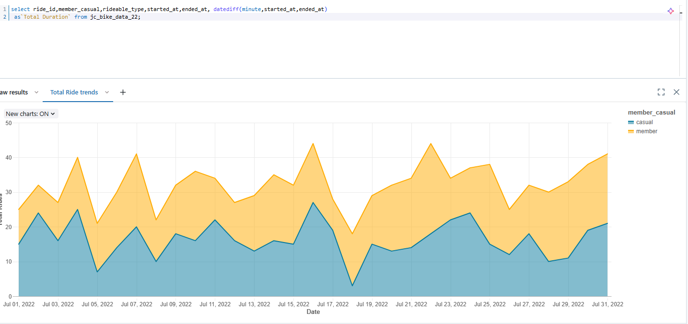
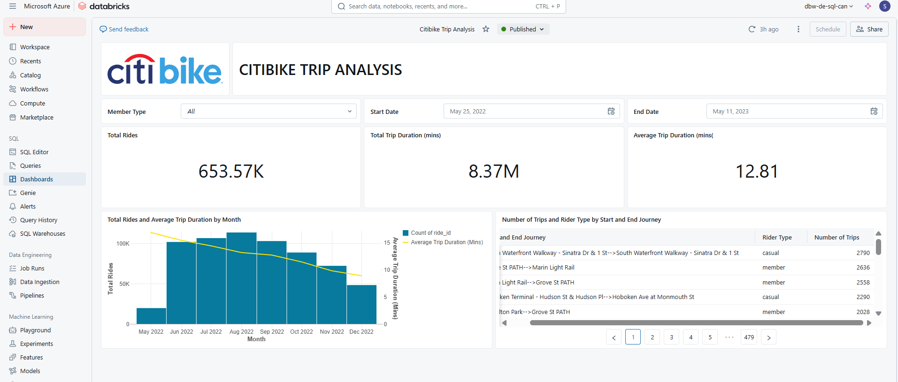
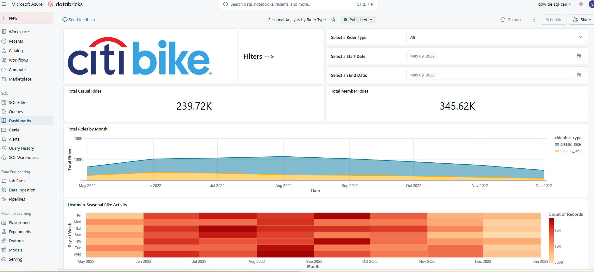

# Citibike Trip Analysis with SQL on Microsoft Azure Databricks

## Project Overview
This project analyzes Citibike trip data to uncover ridership patterns, differences between casual riders and annual members, popular stations, and ride duration trends. The analysis is performed using SQL on Databricks, with results visualized to highlight key insights.

---

## Datasets
- **Primary Datasets**:
Dataset folder: [Google Drive Link](https://drive.google.com/drive/folders/1w80HmoMygH85bABUpU-GKEPFpylp9RbB?usp=sharing)
  - `jc_bike_data_22`: Contains ride details (start/end times, member type, rideable type, and station IDs).
  - `jc_station_data_22`: Maps station IDs to human-readable station names.
- **Derived Datasets**:
  - `most_common_stations`: Frequently used start/end stations.
  - `vw_jc_bike_data_22`: Enhanced view combining trip data with station names (see [SQL Analysis](#sql-analysis)).
  - Custom tables created via SQL queries (e.g., duration calculations).

---

## Key Features
- **Parameters**: 
  - `Start_date` and `End_date` (e.g., May 25, 2022 – Dec 08, 2023).
- **Data Enrichment**:
  - Station names mapped to IDs for readability.
  - Trip duration calculated in minutes.
- **Filters**:
  - Excludes `docked_bike` rides and trips with missing `end_station_id`.
- **Visualizations**: 
  - Ride trends over time (July 2022 snapshot) comparing `member` and `casual` users.

---

## SQL Analysis
### Core Queries

**Basic Trip Analysis Query:**
```sql
SELECT  
  member_casual,  
  rideable_type,  
  started_at,  
  ended_at,  
  DATEDIFF(MINUTE, started_at, ended_at) AS 'Total Duration'  
FROM jc_slice_data_22;
```

**Enhanced Trip View (vw_jc_bike_data_22)**
```sql
CREATE VIEW vw_jc_bike_data_22
AS 
SELECT
  t1.ride_id,
  t1.member_casual,
  t1.rideable_type,
  t1.started_at,
  t1.ended_at,
  DATEDIFF(MINUTE, t1.started_at, t1.ended_at) AS trip_duration_mins,
  t2.station_name AS start_station_name,
  t3.station_name AS end_station_name
FROM jc_bike_data_22 AS t1
INNER JOIN jc_station_data_22 AS t2
  ON t1.start_station_id = t2.station_id
INNER JOIN jc_station_data_22 AS t3
  ON t1.end_station_id = t3.station_id
WHERE 
  t1.rideable_type <> 'docked_bike' 
  AND t1.end_station_id IS NOT NULL;
```
**most_common_stations**
```sql
select 
concat(start_station_name, '-->', end_station_name) as `Start and End Journey`,
member_casual as `Rider Type`,
count(*) as `Number of Trips`
from course_project.citibike.vw_jc_bike_data_22
where started_at between :start_date and :end_date
group by 1,2
order by 3 desc;
```
## 📌 Dashboard Snapshot



